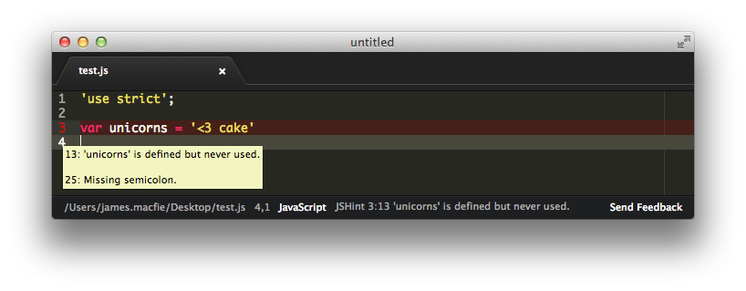

# JSHint

[Atom package](https://atom.io/packages/jshint)

> Validate JavaScript with [JSHint](http://jshint.com)

## Features

- Validates in realtime.
- Marks gutter and line on error.
- Hover over the gutter icon to see the errors.
- First error is displayed in the statusbar.
- Reads your `.jshintrc` config and `jshintConfig` in package.json using the same logic as JSHint.
- Option to only validate on save.

## License

MIT © [Sindre Sorhus](http://sindresorhus.com)
